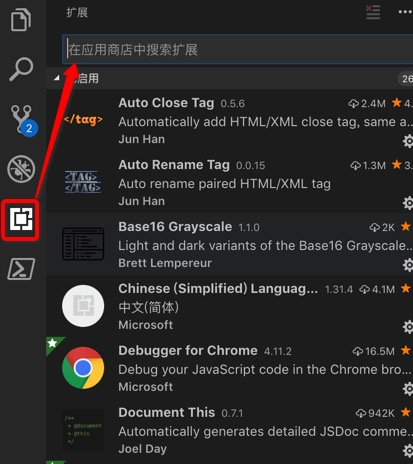
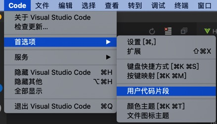
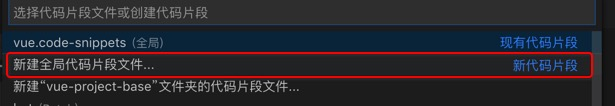

#### Vue-base环境配置

##### 一、开发工具

&emsp;&emsp;【强制】vc code

&emsp;&emsp;【推荐】sublime Text3

&emsp;&emsp;【推荐】webstorm

##### 二、系统环境

&emsp;&emsp;【推荐】node：[8.11.0+](https://nodejs.org/en/)

&emsp;&emsp;【推荐】[nrm](https://blog.csdn.net/anway12138/article/details/79455224)，npm源管理工具

&emsp;&emsp;【强制】[vue cli 3.4.0](https://cli.vuejs.org/zh/guide/installation.html)

&emsp;&emsp;安装步骤参考：[vue官网](https://cli.vuejs.org/zh/guide/installation.html)即可。

##### 三、插件推荐

&emsp;&emsp;`Vetur`：格式化代码，高亮，代码格式检测，括号自动补全等

&emsp;&emsp;格式化功能， Alt+Shift+F （格式化全文），Ctrl+K Ctrl+F（格式化选中代码，两个Ctrl需要同时按着）

&emsp;&emsp;`EsLint`：语法纠错

&emsp;&emsp;`Auto Close Tag`：自动闭合HTML/XML标签

&emsp;&emsp;`Auto Rename Tag `：自动完成另一侧标签的同步修改

&emsp;&emsp;`JavaScript(ES6) code snippets` ： ES6语法智能提示以及快速输入，除js外还支持.ts，.jsx，.tsx，.html，.vue，省去了配置其支持各种包含js代码文件的时间

&emsp;&emsp;`Path Intellisense`：自动路劲补全

&emsp;&emsp;`HTML CSS Support`：让 html 标签上写class 智能提示当前项目所支持的样式 

&emsp;&emsp;附：vscode插件安装

​	

##### 四、模板代码片段

&emsp;&emsp;1、自定义代码片段：vscode —> 首选项—>用户代码片段

	

&emsp;&emsp;2、选择新建全局代码片段文件



&emsp;&emsp;3、将以下内容复制保存

```json
{
    "Print to console": {
        "prefix": "vue",
        "body": [
            "<!-- $1 -->",
            "<template>",
            "<div class='$2'>$5</div>",
            "</template>",
            "",
            "<script>",
            "//这里可以导入其他文件（比如：组件，工具js，第三方插件js，json文件，图片文件等等）",
            "//例如：import 《组件名称》 from '《组件路径》';",
            "",
            "export default {",
            "//import引入的组件需要注入到对象中才能使用",
            "components: {},",
            "data() {",
            "//这里存放数据",
            "return {",
            "",
            "};",
            "},",
            "//监听属性 类似于data概念",
            "computed: {},",
            "//监控data中的数据变化",
            "watch: {},",
            "//方法集合",
            "methods: {",
            "",
            "},",
            "//生命周期 - 创建完成（可以访问当前this实例）",
            "created() {",
            "",
            "},",
            "//生命周期 - 挂载完成（可以访问DOM元素）",
            "mounted() {",
            "",
            "},",
            "beforeCreate() {}, //生命周期 - 创建之前",
            "beforeMount() {}, //生命周期 - 挂载之前",
            "beforeUpdate() {}, //生命周期 - 更新之前",
            "updated() {}, //生命周期 - 更新之后",
            "beforeDestroy() {}, //生命周期 - 销毁之前",
            "destroyed() {}, //生命周期 - 销毁完成",
            "activated() {}, //如果页面有keep-alive缓存功能，这个函数会触发",
            "}",
            "</script>",
            "<style lang='scss' scoped>",
            "//@import url($3); 引入公共css类",
            "$4",
            "</style>"
        ],
        "description": "Log output to console"
    }
}

```

&emsp;&emsp;4、上一步中`"prefix":"vue"`代表快捷键，新建.vue文件，输入vue 按键盘的tab键补全vue模板代码。此外还可根据以上模板按需创建常用快捷代码块。

